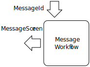
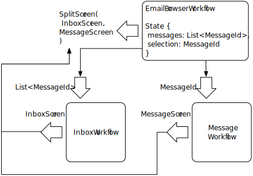
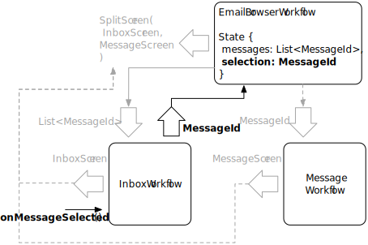

# What is a Workflow?

A [Workflow](../../glossary#workflow-instance) defines the possible states and behaviors of components of a particular type.
The overall state of a Workflow has two parts:

* [Props](../../glossary#props), configuration information provided by whatever is running the Workflow
* And the private [State](../../glossary#state) managed by the Workflow itself

At any time, a Workflow can be asked to transform its current Props and State into a [Rendering](../../glossary#rendering) that is suitable for external consumption.
A Rendering is typically a simple struct with display data, and event handler functions that can enqueue [Workflow Actions](../../glossary#action) — functions that update State, and which may at the same time emit [Output](../../glossary#output) events.

For example, a Workflow running a simple game might be configured with a description of the participating `Players` as its Props, build `GameScreen` structs when asked to render, and emit a `GameOver` event to signal that is finished.

A workflow Rendering usually serves as a view model in iOS or Android apps, but that is not a requirement.
In fact, this page includes no details about how platform specific UI code is driven.
See [Workflow UI](../ui-concepts) for that discussion.

!!! note
     Readers with an Android background should note the lower case _v_ and _m_ of "view model" — this notion has nothing to do with Jetpack `ViewModel`.

## Composing Workflows

Workflows run in a tree, with a single root Workflow declaring it has any number of children for a particular state, each of which can declare children of their own, and so on.
The most common reason to compose Workflows this way is to build big view models (Renderings) out of small ones.

For example, consider an overview / detail split screen, like an email app with a list of messages on the left, and the body of the selected message on the right.
This could be modeled as a trio of Workflows:

**InboxWorkflow**

* Expects a `List<MessageId>` as its Props
* Rendering is an `InboxScreen`, a struct with displayable information derived from its Props, and an `onMessageSelected()` function
* When `onMessageSelected()` is called, a WorkflowAction is executed which emits the given `MessageId` as Output
* Has no private State

**MessageWorkflow**

* Requires a `MessageId` Props value to produce a `MessageScreen` Rendering
* Has no private State, and emits no Output

**EmailBrowserWorkflow**

* State includes a `List<MessageId>`, and the selected `MessageId`
* Rendering is a `SplitScreen` view model, to be assembled from the renderings of the other two Workflows
* Accepts no Props, and emits no Output

When `EmailBrowserWorkflow` is asked to provide its Rendering, it in turn asks for Renderings from its two children.

* It provides the `List<MessageId>` from its state as the Props for `EmailInboxWorkflow` and receives an `InBoxScreen` rendering in return. That `InboxScreen` becomes the left pane of a `SplitScreen` Rendering.
* For the `SplitScreen`'s right pane, the browser Workflow provides the currently selected `MessageId` as input to `EmailMessageWorkflow`, to get a `MessageScreen` rendering.

!!! note
    Note that the two children, `EmailInboxWorkflow` and `EmailMessageWorkflow`, have no knowledge of each other, nor of the context in which they are run.

The `InboxScreen` rendering includes an `onMessageSelected(MessageId)` function.
When that is called, `EmailInboxWorkflow` enqueues an Action function that emits the given `MessageId` as Output.
`EmailBrowserWorkflow`  receives that Output, and enqueues another Action that updates the `selection: MessageId` of its State accordingly.

Whenever such a [Workflow Action cascade](../../glossary#action-cascade) fires, the root Workflow is asked for a new Rendering.
Just as before, `EmailInboxWorkflow` delegates to its two children for their Renderings, this time providing the new value of `selection` as the updated Props for `MessageWorkflow`.

### Workers

TBD