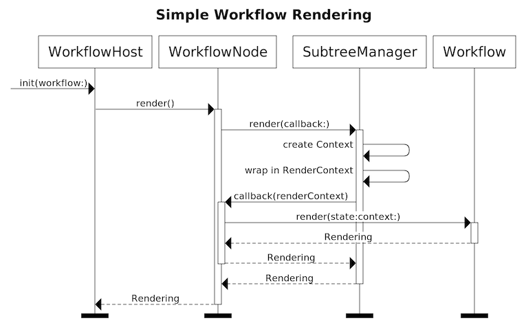
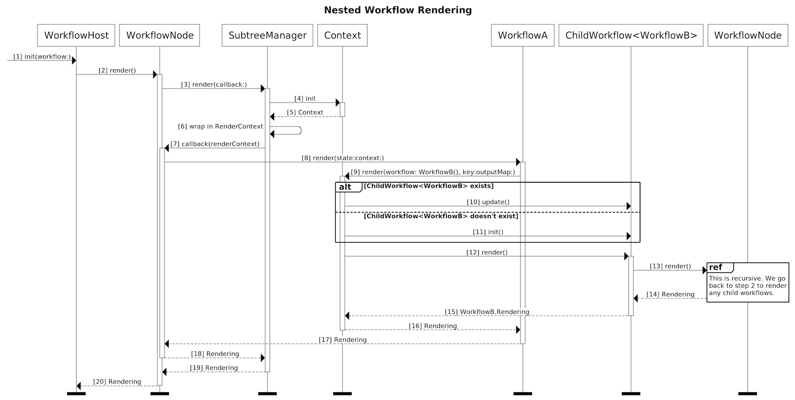

# Implementation Notes

!!! info "Work in progress…"
    So far we only have notes on the implementation of the Swift runtime.
    They're actually pretty close to what goes on in Kotlin, the `WorkflowNode` and `SubtreeManager` classes in particular.

## Swift

### The Render loop

#### Initial pass



The root of your workflow hierarchy gets put into a `WorkflowHost` (if you're using
`ContainerViewController` this is created for you). As part of its initializer, `WorkflowHost`
creates a `WorkflowNode` that wraps the given root `Workflow` (and keeps track of the `Workflow`'s
`State`). It then calls `render()` on the node:

```swift
// WorkflowHost
public init(workflow: WorkflowType, debugger: WorkflowDebugger? = nil) {
    self.debugger = debugger

    self.rootNode = WorkflowNode(workflow: workflow)  // 1. Create the node

    self.mutableRendering = MutableProperty(self.rootNode.render())  // 2. Call render()
```

`WorkflowNode` contains a `SubtreeManager`, whose primary purpose is to manage child workflows
(more on this later). When `render()` gets invoked on the node, it calls `render` on the
`SubtreeManager` and passes a closure that takes a `RenderContext` and returns a `Rendering` for
the `Workflow` associated with the node.

```swift
// WorkflowNode
func render() -> WorkflowType.Rendering {
    return subtreeManager.render { context in
        return workflow.render(
            state: state,
            context: context
        )
    }
}
```

The `SubtreeManager` instantiates a `RenderContext` and invokes the closure that was passed in.
This last step generates the `Rendering`. This `Rendering` then gets passed back up the call stack
until it reaches the `WorkflowHost`.

#### Composition

In cases where a `Workflow` has child `Workflow`s, the render sequence is similar. The [tutorial]
(../tutorial/building-a-workflow/#the-render-context) goes through this in more detail.



Essentially, a `Workflow` containing child `Workflow`s calls `render(context:key:outputMap:)` on
each child `Workflow` and passes in the `RenderContext`. The context does some bookkeeping for the
child `Workflow` (creating or updating a `ChildWorkflow<T>`) and then calls `render()`.
`ChildWorkflow<T>.render()` calls `render()` on its `WorkflowNode` and we recurse back to step 2.

