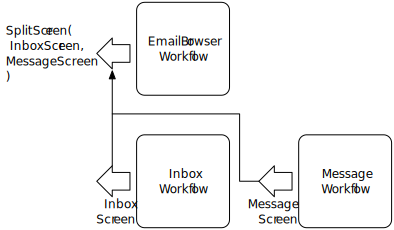

# Workflow UI

This page provides a high level overview of Workflow UI, the companion that allows [Workflow Core](../concepts) to drive Android and iOS apps.
To see how these ideas are realized in code, move on to [Coding Workflow UI](../ui-in-code).

!!! warning Kotlin WIP
    The `Screen` interface that is so central to this discussion has reached Kotlin very recently, via `v1.8.0-beta01`.
    Thus, if you are working against the most recent non-beta release, you will find the code blocks here don't match what you're seeing.

    Square is using the `Screen` machinery introduced with the beta at the heart of our Android app suite, and we expect the beta period to be a short one.
    The Swift `Screen` protocol _et al._ have been in steady use for years.

## What's a Screen?

Most Workflow implementations produce `struct` / `data class` [renderings](../../glossary#rendering) that can serve as view models.
Such a rendering provides enough data to paint a complete UI, including functions to be called in response to UI events.

These view model renderings implement the `Screen` [protocol](https://github.com/square/workflow-swift/blob/main/WorkflowUI/Sources/Screen/Screen.swift) / [interface](https://github.com/square/workflow-kotlin/blob/main/workflow-ui/core-common/src/main/java/com/squareup/workflow1/ui/Screen.kt) to advertise that this is their intended use.
The core service provided by Workflow UI is to transform `Screen` types into platform-specific view objects, and to keep those views updated as new `Screen` renderings are emitted.

`Screen` is the lynch pin that ties the Workflow Core and Workflow UI worlds together, the basic UI building block for Workflow-driven apps.
A `Screen` is an object that can be presented as a basic 2D UI box, like an `android.view.View` or a `UIViewController`.
And Workflow UI provides the glue that allows you to declare (at compile time!) that instances of `FooScreen : Screen` are used to drive `FooViewController`, `layout/foo_screen.xml`, or `@Composable fun Content(FooScreen, ViewEnvironment)`.

!!! faq "Why \"Screen\"?"
    We chose the name "Screen" because "View" would invite confusion with the like-named Android and iOS classes, and because "Box" didn't occur to us.
    (No one seems to have been bothered by the fact that `Screen` and iOS's `UIScreen` are unrelated.)

    And really, we went with "Screen" because it's the nebulous term that we and our users have always used to discuss our apps:
    "Go to the Settings screen."
    "How do I get to the Tipping screen?"
    "The Cart screen is shown in a modal over the Home screen on tablets."
    It's a safe bet you understood each of those sentences.

## Workflow Tree, Rendering Tree, View Tree

In the Workflow Core page we discussed how Workflows can be [composed as trees](../concepts#composing-workflows), like this email app driven by a trio of Workflows that assemble a composite `SplitScreen` rendering.

Let's take a look at how Workflow UI transforms such a [container screen](../../glossary#container-screen) into a [container view](../../glossary#container-view).

The main connection between the Workflow Core runtime and a native view system is the stream of Rendering objects from the root Workflow, `EmailBrowserWorkflow` in this discussion.
From that point on, the flow of control is entirely in view-land.

The precise details of that journey vary between Android and iOS in terms of naming, subclassing v. delegating, and so on, mainly to ensure that the API is idiomatic for each audience.
None the less, the broad strokes are the same.
(Move on to [Coding Workflow UI](../ui-in-code) to drill into the platform-specific details.)

Each flavor of Workflow UI provides two core container helpers, both pictured below:

* A "workflow container", able to instantiate and update a view that can display Screen instances of the given type
    * In iOS this is `DescribedViewController`
    * For Android Classic we provide `WorkflowViewStub`, very similar to `android.view.ViewStub`.
    * Android Jetpack Compose code can call `@Compose fun WorkflowRendering()`.
* A "workflow root container", able to field a stream of renderings from the Workflow Core runtime, and pass them on to a workflow container
    * `ContainerViewController` for iOS
    * `WorkflowLayout` for Android Classic
    * `@Compose fun Workflow.renderAsState()` for Android Jetpack Compose

![A box labeled Runtime contains the EmailBrowserWorkflow. It slightly overlaps a larger box labeled Native view system. A line from the EmailBrowserWorkflow's Rendering port connects to a  box at the top of the Native View System, labeled Workflow root container. That Rendering, a SplitScreen(InboxScreen, MessageScreen), is passed from the Workflow root container down to a bi-part box labeled Workflow container / Custom split view. From there, InboxScreen is passed down to a similar bi-part box labeled Workflow container / Custom inbox view, and MessageScreen to Workflow container / Custom message view](../images/down_the_view_tree.svg)

When the runtime in our example is started, the flow is something like this:

* `EmailBrowserWorkflow` is asked for its first Rendering, a `SplitScreen` wrapping an `InboxScreen` and a `MessageScreen`.
* The _Workflow root container_ receives that, and hands it off to its _Workflow container_.
    * The container is able to resolve that `SplitScreen` instances can be displayed by views of the associated type _Custom split view_.
    * The container builds that view, and passes it the `SplitScreen`.
* _Custom split view_ is written with two _Workflow containers_ of its own, one for the left side and for the right.
    * The left hand container resolves `InboxScreen` to _Custom inbox view_, builds one, and hands the rendering that new view.
    * The right hand container does the same for the `MessageScreen`, creating a _Custom message view_ to display it.

Sooner or later the state of `EmailBrowserWorkflow` or one of its children will change.
Perhaps a new message has been received.
Perhaps an event handler function on `InboxScreen` has been called because the user wants to read something else now.
Regardless of where in the Workflow hierarchy the update happens, the entire tree will be re-rendered: `EmailBrowserWorkflow` will be asked for a new Rendering, it will ask its children for the same, and so on.

!!! tip "Yes, everything renders when anything changes"
    New Workflow developers generally freak out when they hear that the entire tree is re-rendered when any state anywhere updates.
    Remember that `render()` implementations are expected to be idempotent, and that their job is strictly declarative: `render()` effectively means "I assume these children are running, and that I am subscribed to these work streams. Please make sure that stays the case, or fire up some new ones if needed."
    Another way is to think of them as declaring how to adapt the internal State into the external Rendering.
    These calls should be cheap, with all real work happening outside of the `render()` call.

    Optimizations may prevent rendering calls that are clearly redundant from being made, but semantically one should assume that the whole world is rendered when any part of the world changes.

Once the runtime's Workflow tree finishes re-rendering, the new `SplitScreen` is passed through the native view system like so:

* The _Workflow root container_ once again passes the new `SplitScreen` to its _Workflow container_, because that is the only trick it knows.
    * That container recognizes that `SplitScreen` can be accepted by the _Custom split view_ it created last time, and so there is no work to be done.
    * The existing _Custom split view_ receives the new `SplitScreen`.
* Just like last time, _Custom split view_ passes `InboxScreen` to the _Workflow container_ on its left, and `MessageScreen` to that on its right.
    * The left hand _Workflow container_ sees that it is already showing a _Custom inbox view_ and passes `InboxScreen` rendering through.
    * The same things happens with `MessageScreen`, and the _Custom message view_ previously built by the right hand _Workflow container_.

As is always the case with view code, _Custom inbox view_ and _Custom message view_ should be written with care to avoid redundant work, comparing what they are already showing with what they are being asked to show now.
(A simple way to do this is to keep a Screen type's display data in a separate object from its event handlers, as an Equatable Swift struct, or as a Kotlin data class.
Always hold on to the latest Screen in a `var`, and write UI click handlers and to reference it.)

The update scenario would be different if the types of any of the `Screen` Renderings changed.
Suppose our email app is able to host both email and voice mail in its inbox, and that the `MessageScreen` from the previous update is replaced with a `VoicemailScreen` this time.
In that case, _Custom message view_ would refuse the new Rendering, and the right hand _Workflow container_ that created it would destroy it.
A _Custom voicemail view_ would be created in its stead, and that new view would paint itself with the information from the `VoicemailScreen`.

So just how do these containers know what views to create for what Screen types?
Those details are very language and platform specific, and are covered in the next page, under [Building views from Screens](../ui-in-code#view-binding).

## ViewEnvironment

TK
